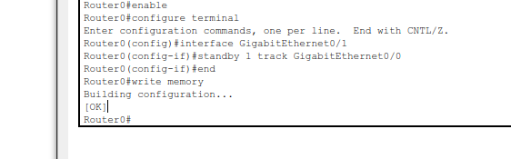
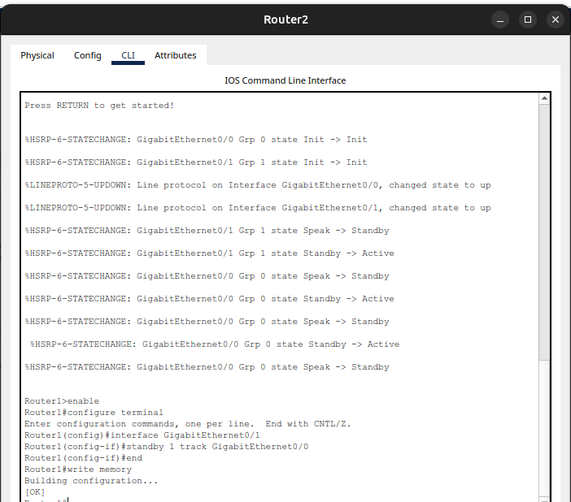
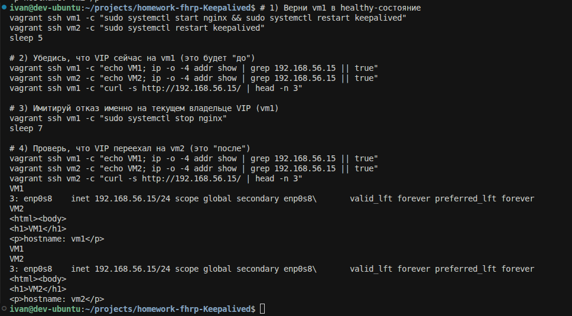

## Домашнее задание: FHRP (HSRP) + Keepalived

**Задание 1 (Cisco Packet Tracer / HSRP)**: настроить отслеживание интерфейса `Gi0/0`

[text](1/hsrp_advanced.pkt)

**Задание 2 (Linux / Keepalived)**: 2 “сервера” с keepalived+web, bash‑скрипт проверки, `vrrp_script` каждые 3 секунды, демонстрация переезда VIP

[text](1/check_web.sh)

[text](ansible/roles/keepalived/templates/keepalived.conf.j2)

[text](ansible/site.yml)

